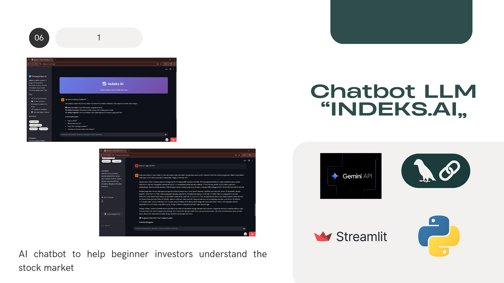

## LLM Chatbot IHSG Check

This project implements an **interactive chatbot** powered by a **Large Language Model (LLM)** to provide information, checks, and analysis related to the **IHSG** (*Indeks Harga Saham Gabungan*, or Jakarta Composite Index) and Indonesian stock market data. The chatbot is hosted on a web interface built with Streamlit.



-----

## Key Features

  * **LLM-Powered Interaction:** Utilizes a Large Language Model (likely through the `langchain` framework) to process user queries and generate relevant, contextual responses about the IHSG.
  * **Streamlit Web Interface:** Provides an easy-to-use graphical user interface (GUI) for chat interaction.
  * **IHSG-Specific Knowledge:** Focused on providing information and checks related to the Jakarta Composite Index and general market data.

-----

## Technology Used

| Category | Technology | Description |
| :--- | :--- | :--- |
| **LLM & Framework** | LangChain, OpenAI, Google Generative AI | Frameworks and models used for integrating the LLM and managing conversation chains. |
| **GUI & Web** | Streamlit | Python library for building and hosting the interactive chatbot interface. |
| **Data Processing** | Pandas | Used for handling and processing data. |
| **APIs** | `google-genai` or `openai` | Required API keys are necessary for the LLM backend. |

-----

## Installation Prerequisites

To run this project, you need **Python 3.x** and an **API Key** for the chosen LLM service (e.g., OpenAI or Google GenAI).

1.  **Clone the repository and navigate into the folder.**

    ```bash
    git clone <YOUR_REPO_URL>
    cd <REPO_FOLDER_NAME>
    ```

2.  **Install the required Python libraries.**

    ```bash
    pip install -r requirements.txt
    ```

3.  **Set API Key (Environment Variable):** Set your LLM API key as an environment variable before running the script. The script checks for API key presence.

    ```bash
    export OPENAI_API_KEY='YOUR_KEY' 
    # OR
    export GOOGLE_API_KEY='YOUR_KEY'
    ```

-----

## Project Structure

```
.
├── indeksai.py                  # Main Python script containing the Streamlit app and LLM logic.
├── requirements.txt             # List of Python dependencies (e.g., streamlit, langchain, openai).
├── chatbott.png                 # Screenshot or diagram of the chatbot interface.
└── README.md
```

-----

## Example Usage

After setting your API key and installing the dependencies, run the application using Streamlit:

1.  **Run the application:**

    ```bash
    streamlit run indeksai.py
    ```

2.  **Access the Chatbot:** Your web browser will open automatically (usually at `http://localhost:8501`).

3.  **Start Querying:** Use the chat interface to ask questions regarding the IHSG, stock performance, or general market information.

-----

